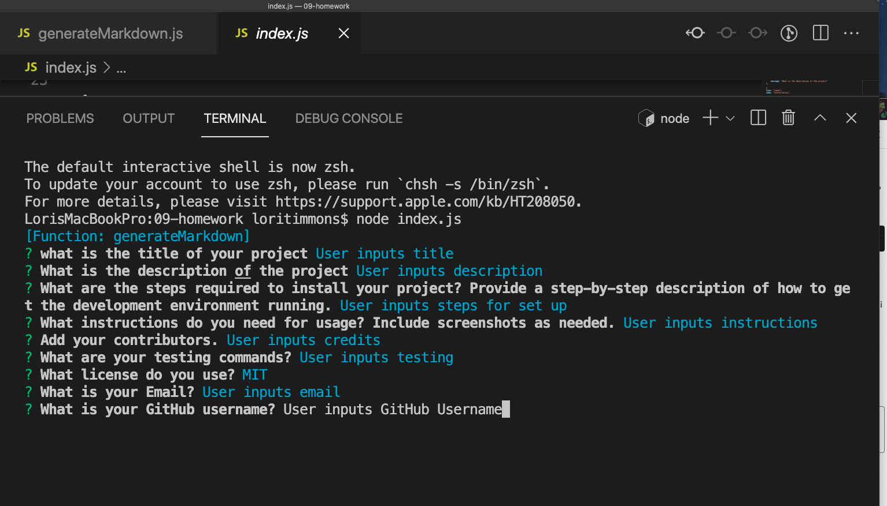
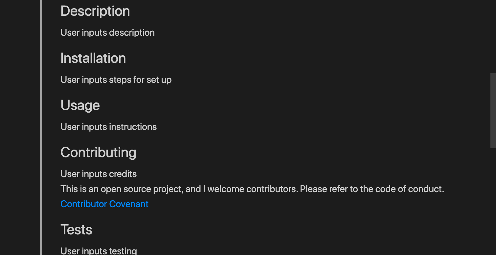
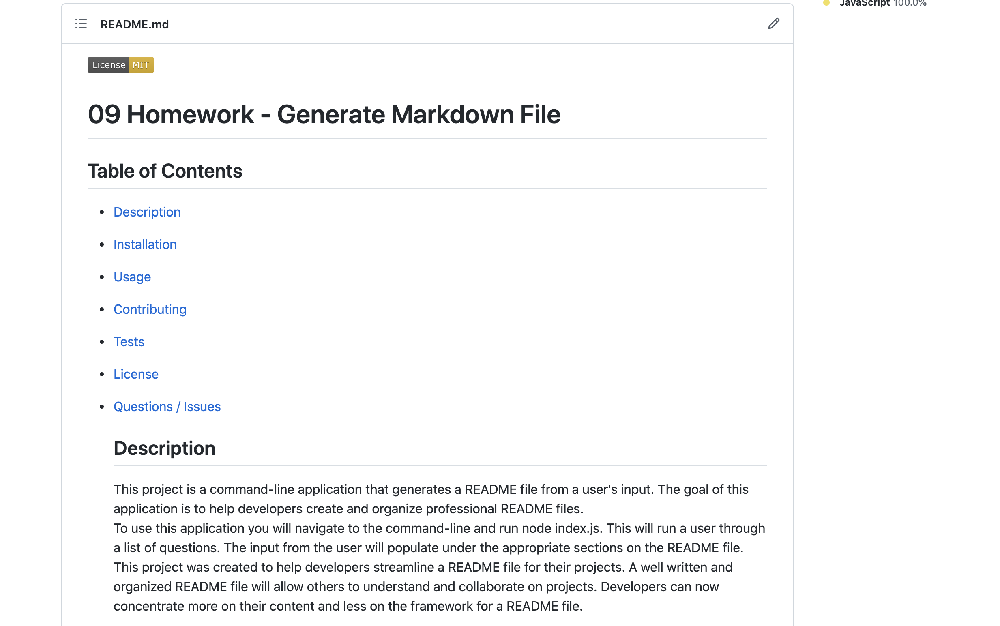

  # 09 Homework - Generate Markdown File

## Table of Contents 
* [Description](#Description)   
* [Installation](#Installation) 
* [Usage](#Usage) 
* [Contributing](#Contributing) 
* [Tests](#Tests) 
* [License](#License) 
* [Questions / Issues](#Questions) 

  ## Description
  This project is a command-line application that generates a README file from a user's input. The goal of this application is to help developers create and organize professional README  files.  To use this application you will navigate to the command-line and run node index.js. This will run a user through a list of questions. The input from the user will populate under the appropriate sections on the README  file.  This project was created to help developers streamline a README file for their projects. A well written and organized README file will allow others to understand and collaborate on projects. Developers can now concentrate more on their content and less on the framework for a README file. 

  ## Installation
  To create this you need to work in the nodes modules and require the inquirer package. Please use the below steps to set up your project.   * Create a .gitignore file to store your node_modules and .ds_store    * run and npm init    * install your npm dependencies (package.json)   * Require inquire

  ## Usage
  Use this application to create an awesome README file.   Demonstration Video:[!Watch the video](https://watch.screencastify.com/v/2Vcnc44jwvjJCS1W2rbg) 
           

  ## Contributing
  Online resources   https://guides.github.com/features/mastering-markdown/  https://gist.github.com/lukas-h/2a5d00690736b4c3a7ba  https://www.contributor-covenant.org/  
  This is an open source project. I welcome contributors. Please refer to the code of conduct.  
  [Contributor Covenant](https://www.contributor-covenant.org/version/2/1/code_of_conduct/) 
  

  ## Tests
  TBD
  
  ## License

  
   
  https://www.eclipse.org/legal/epl-2.0/ 

  ## Questions
  #### Contact Me @: lorietimmons@gmail.com 
  #### GitHub Profile: LoriTimmons
  #### GitHub Repo Link: https://github.com/LoriTimmons/09-homework
